# 🏆 Distributed Online Auction System

<div align="center">


**Enterprise-grade auction system with real-time bidding, distributed messaging, and comprehensive session management**

[Features](#-features) • [Quick Start](#-quick-start) • [Architecture](#-architecture) • [API](#-api-documentation) • [Contributing](#-contributing)

</div>

---

## 📋 Table of Contents

- [About](#-about-the-project)
- [Features](#-features)
- [Technology Stack](#-technology-stack)
- [Architecture](#-architecture)
- [Getting Started](#-getting-started)
- [Usage Examples](#-usage-examples)
- [API Documentation](#-api-documentation)
- [Testing](#-testing)
- [Deployment](#-deployment)
- [Contributing](#-contributing)
- [License](#-license)

---

## 🎯 About The Project

A **comprehensive enterprise application** for online auctions featuring real-time bidding, built with Jakarta EE 10 and modern Java technologies. Demonstrates production-grade patterns in distributed systems, message-driven architecture, and enterprise development.

### Key Highlights

- 🎓 **Educational** - Learn enterprise Java patterns and best practices
- 🏢 **Production-Ready** - Built with enterprise-grade technologies
- 🚀 **Scalable** - Distributed architecture with horizontal scaling support
- 🔄 **Real-Time** - WebSocket-based instant notifications
- 🔒 **Secure** - Comprehensive session and user management

---

## ✨ Features

### Core Capabilities

| Feature | Description |
|---------|-------------|
| 🏷️ **Auction Management** | Create, monitor, and manage auctions with automatic expiration |
| 💰 **Real-Time Bidding** | Thread-safe concurrent bid handling with instant validation |
| 👥 **User Management** | Registration, authentication, and activity tracking |
| 📡 **Live Notifications** | WebSocket-based real-time bid and auction updates |
| 🔄 **Message Queue** | JMS integration for asynchronous event processing |
| 📊 **Analytics** | Comprehensive auction and bidding statistics |
| 🧪 **Testing Suite** | Unit, integration, and performance tests |

### Technical Highlights

- ⚡ **Thread-Safe Operations** - ConcurrentHashMap and atomic operations
- 🎯 **Stateless EJBs** - Horizontal scalability support
- 🔔 **Event-Driven** - Message-Driven Beans for decoupled processing
- 🛡️ **Filter Chain** - Session validation and security filters
- 📦 **Clean Architecture** - DTOs for data encapsulation

---

## 🛠️ Technology Stack

### Core Technologies

| Category | Technologies |
|----------|-------------|
| **Backend** | Java 11+, Jakarta EE 10, EJB 4.0.1, JMS 3.1.0, CDI 4.0.1 |
| **Web Layer** | Servlet API 6.0.0, WebSocket, JSP |
| **Frontend** | JavaScript ES6+, CSS3, WebSocket API |
| **Build** | Maven 3.x, Maven Compiler Plugin |
| **Testing** | JUnit 5.9.3, Mockito 5.3.1, Testcontainers 1.18.3, JaCoCo 0.8.8 |
| **Server** | GlassFish 7.x |

---

## 🏗️ Architecture

### System Architecture Overview

```mermaid
graph TB
    Browser[🖥️ Web Browser]
    WSClient[🔌 WebSocket Client]
    
    Servlet[🌐 Servlets & Filters]
    WSEndpoint[📡 WebSocket Endpoints]
    
    AuctionEJB[⚙️ Auction Service]
    BidEJB[💰 Bid Service]
    UserEJB[👤 User Service]
    SessionMgr[🔐 Session Manager]
    AuctionMgr[⏰ Auction Manager]
    
    JMS[📨 JMS Queue]
    MDB[📬 Message Driven Bean]
    
    Browser -->|HTTP/HTTPS| Servlet
    WSClient -->|WebSocket| WSEndpoint
    
    Servlet --> AuctionEJB
    Servlet --> BidEJB
    Servlet --> UserEJB
    Servlet --> SessionMgr
    
    WSEndpoint --> AuctionMgr
    WSEndpoint --> SessionMgr
    
    BidEJB -->|Send| JMS
    AuctionEJB -->|Send| JMS
    JMS -->|Consume| MDB
    MDB -->|Broadcast| WSEndpoint
    
    AuctionMgr -.->|Monitor| AuctionEJB
    
    classDef clientStyle fill:#4A90E2,stroke:#2E5C8A,stroke-width:3px,color:#fff
    classDef webStyle fill:#F39C12,stroke:#C87F0A,stroke-width:3px,color:#fff
    classDef businessStyle fill:#9B59B6,stroke:#7D3C98,stroke-width:3px,color:#fff
    classDef messageStyle fill:#27AE60,stroke:#1E8449,stroke-width:3px,color:#fff
    
    class Browser,WSClient clientStyle
    class Servlet,WSEndpoint webStyle
    class AuctionEJB,BidEJB,UserEJB,SessionMgr,AuctionMgr businessStyle
    class JMS,MDB messageStyle
```



### Bid Placement Flow

```mermaid
sequenceDiagram
    participant U as 👤 User
    participant S as Servlet
    participant B as Bid Service
    participant J as JMS Queue
    participant M as MDB
    participant W as WebSocket
    participant C as 📱 Clients
    
    U->>+S: POST /auction/bid
    S->>+B: placeBid()
    
    alt ✅ Valid Bid
        B->>B: Validate amount
        B->>B: Update auction
        B->>J: Send message
        B-->>-S: BidDTO
        S-->>-U: 200 OK
        
        J->>+M: Deliver
        M->>+W: Broadcast
        W->>C: Push update
        W-->>-M: Done
        M-->>-J: Ack
    else ❌ Invalid Bid
        B-->>S: Error
        S-->>U: 400 Bad Request
    end
```



### Real-Time Notification Architecture

```mermaid
graph TB
    A[📢 New Bid]
    B[🚀 Auction Started]
    C[🏁 Auction Ended]
    D[❌ Auction Cancelled]
    
    E[⚙️ EJB Business Logic]
    F[📨 JMS Queue]
    G[📬 Message-Driven Bean]
    
    H[📡 WebSocket Manager]
    I[🔐 Session Manager]
    
    J[🌐 Browser 1]
    K[🌐 Browser 2]
    L[🌐 Browser N]
    
    A --> E
    B --> E
    C --> E
    D --> E
    
    E --> F
    F --> G
    G --> H
    
    H --> I
    I --> J
    I --> K
    I --> L
    
    classDef eventStyle fill:#E74C3C,stroke:#C0392B,stroke-width:3px,color:#fff
    classDef processStyle fill:#3498DB,stroke:#2980B9,stroke-width:3px,color:#fff
    classDef distStyle fill:#9B59B6,stroke:#8E44AD,stroke-width:3px,color:#fff
    classDef clientStyle fill:#2ECC71,stroke:#27AE60,stroke-width:3px,color:#fff
    
    class A,B,C,D eventStyle
    class E,F,G processStyle
    class H,I distStyle
    class J,K,L clientStyle
```



### Component Interaction Diagram

```mermaid
graph TB
    E1[📦 Auction Entity]
    E2[📦 Bid Entity]
    E3[📦 User Entity]
    
    D1[📋 AuctionDTO]
    D2[📋 BidDTO]
    D3[📋 BidUpdateMessage]
    
    S1[⚙️ Auction Service]
    S2[⚙️ Bid Service]
    S3[⚙️ User Service]
    
    SG1[🔒 Auction Manager]
    SG2[🔒 Session Manager]
    
    A1[🔄 Notification MDB]
    
    S1 --> E1
    S2 --> E2
    S3 --> E3
    
    S1 --> D1
    S2 --> D2
    S2 --> D3
    
    S1 -.->|Monitor| SG1
    S2 -->|Publish| A1
    S3 -.->|Track| SG2
    
    A1 -->|Broadcast| SG2
    
    classDef entityStyle fill:#4A90E2,stroke:#2E5C8A,stroke-width:3px,color:#fff
    classDef dtoStyle fill:#F39C12,stroke:#C87F0A,stroke-width:3px,color:#fff
    classDef serviceStyle fill:#9B59B6,stroke:#7D3C98,stroke-width:3px,color:#fff
    classDef singletonStyle fill:#27AE60,stroke:#1E8449,stroke-width:3px,color:#fff
    classDef asyncStyle fill:#E74C3C,stroke:#C0392B,stroke-width:3px,color:#fff
    
    class E1,E2,E3 entityStyle
    class D1,D2,D3 dtoStyle
    class S1,S2,S3 serviceStyle
    class SG1,SG2 singletonStyle
    class A1 asyncStyle
```



### Design Patterns

| Pattern | Implementation | Purpose |
|---------|----------------|---------|
| **Singleton** | `AuctionManagerSingleton`, `UserSessionManagerBean` | Shared state & lifecycle management |
| **Stateless Session Bean** | `AuctionServiceBean`, `BidServiceBean` | Scalable, concurrent business logic |
| **Message-Driven Bean** | `BidNotificationMDB` | Asynchronous event processing |
| **DTO** | `AuctionDTO`, `BidDTO` | Data encapsulation & transfer |
| **Front Controller** | `AuctionServlet` | Centralized request handling |
| **Observer** | WebSocket + JMS | Real-time event notification |
| **Filter Chain** | `SessionFilter`, `AdminFilter` | Request preprocessing & security |

---

## 🚀 Getting Started

### Prerequisites

Ensure you have the following installed:

```bash
# Java 11+
java -version

# Maven 3.6+
mvn -version

# Git
git --version
```

**GlassFish Server 7.x**
- Download: [glassfish.org/download](https://glassfish.org/download)
- Or use Docker: `docker pull glassfish:7.0.0-jdk11`

### Quick Installation

```bash
# 1. Clone repository
git clone https://github.com/isharax9/AuctionSystem.git
cd AuctionSystem

# 2. Build project
mvn clean install

# 3. Run tests
mvn test

# 4. Package application
mvn package
```

### GlassFish Configuration

#### Option A: Manual Setup

```bash
# Start GlassFish
cd $GLASSFISH_HOME/bin
./asadmin start-domain domain1

# Configure JMS Resources
./asadmin create-jms-resource --restype jakarta.jms.Queue \
  --property Name=BidNotificationQueue jms/BidNotificationQueue

./asadmin create-jms-resource --restype jakarta.jms.QueueConnectionFactory \
  jms/BidNotificationQueueFactory
```

#### Option B: Docker Setup

```bash
docker run -d \
  -p 8080:8080 \
  -p 4848:4848 \
  --name glassfish \
  glassfish:7.0.0-jdk11
```

### Deploy Application

```bash
# Using asadmin
./asadmin deploy target/AuctionSystem.war

# Verify deployment
./asadmin list-applications
```

### Access Points

| Service | URL | Purpose |
|---------|-----|---------|
| **Main App** | `http://localhost:8080/AuctionSystem/` | Primary interface |
| **Real-Time** | `http://localhost:8080/AuctionSystem/real-time-notifications.html` | Live updates |
| **Session Admin** | `http://localhost:8080/AuctionSystem/session-admin` | Admin panel |
| **Admin Console** | `http://localhost:4848` | GlassFish admin |

---

## 📖 Usage Examples

### Creating an Auction (Java)

```java
@Inject
private AuctionServiceRemote auctionService;

public void createAuction() {
    AuctionDTO auction = auctionService.createAuction(
        "Vintage Camera",
        "Rare 1950s Leica M3 in excellent condition",
        250.0,      // Starting price
        3,          // Duration: 3 hours
        30          // Duration: 30 minutes
    );
    System.out.println("Created: " + auction.getAuctionId());
}
```

### Placing a Bid (Java)

```java
@Inject
private BidServiceRemote bidService;

public boolean placeBid(Long auctionId, String username, double amount) {
    BidDTO bid = bidService.placeBid(auctionId, username, amount);
    return bid != null; // Returns true if successful
}
```

### Real-Time Updates (JavaScript)

```javascript
// Connect to WebSocket
const socket = new WebSocket('ws://localhost:8080/AuctionSystem/auction-updates');

// Handle incoming updates
socket.onmessage = (event) => {
    const update = JSON.parse(event.data);
    console.log(`New bid: $${update.bidAmount} by ${update.bidder}`);
    
    // Update UI
    document.getElementById('currentBid').textContent = `$${update.bidAmount}`;
    document.getElementById('bidder').textContent = update.bidder;
};

// Send bid
function placeBid(auctionId, amount) {
    socket.send(JSON.stringify({
        type: 'BID',
        auctionId: auctionId,
        amount: amount
    }));
}
```

---

## 🔌 API Documentation

### Core Endpoints

| Method | Endpoint | Description | Request Body |
|--------|----------|-------------|--------------|
| `GET` | `/auction` | List active auctions | - |
| `GET` | `/auction/{id}` | Get auction details | - |
| `POST` | `/auction` | Create new auction | `AuctionDTO` |
| `POST` | `/auction/{id}/bid` | Place a bid | `BidDTO` |
| `GET` | `/auction/history` | Completed auctions | `?page=1&size=10` |
| `POST` | `/auction/{id}/close` | Close auction early | - |
| `GET` | `/session-admin` | Active sessions | - |

### Request/Response Examples

#### Create Auction

**Request:**
```json
POST /auction
Content-Type: application/json

{
  "title": "Antique Vase",
  "description": "Ming Dynasty ceramic vase, authenticated",
  "startingPrice": 1000.0,
  "durationHours": 4,
  "durationMinutes": 30
}
```

**Response:**
```json
{
  "auctionId": 1,
  "title": "Antique Vase",
  "startingPrice": 1000.0,
  "currentHighestBid": 1000.0,
  "currentHighestBidder": null,
  "startTime": "2024-01-15T10:00:00",
  "endTime": "2024-01-15T14:30:00",
  "active": true,
  "totalBidsCount": 0,
  "status": "ACTIVE"
}
```

#### Place Bid

**Request:**
```json
POST /auction/1/bid
Content-Type: application/json

{
  "username": "bidder123",
  "amount": 1100.0
}
```

**Response:**
```json
{
  "bidId": 1,
  "auctionId": 1,
  "username": "bidder123",
  "amount": 1100.0,
  "timestamp": "2024-01-15T10:15:00",
  "valid": true
}
```

---

## 📂 Project Structure

```
AuctionSystem/
├── src/main/java/com/auction/
│   ├── config/              # WebSocket configuration
│   ├── dto/                 # Data Transfer Objects
│   ├── ejb/                 # Enterprise JavaBeans
│   │   ├── *ServiceBean.java       # Business logic
│   │   ├── *ServiceRemote.java     # Remote interfaces
│   │   ├── AuctionManagerSingleton.java
│   │   └── BidNotificationMDB.java
│   ├── entity/              # Domain entities (Auction, Bid, User)
│   ├── filter/              # Servlet filters (Session, Admin, Encoding)
│   ├── servlet/             # Web servlets
│   ├── session/             # Session management
│   └── websocket/           # WebSocket endpoints
├── src/main/webapp/
│   ├── WEB-INF/web.xml      # Deployment descriptor
│   ├── css/                 # Stylesheets
│   ├── js/                  # JavaScript modules
│   ├── error/               # Error pages (404, 500)
│   └── *.jsp, *.html        # Web pages
├── src/test/java/           # Test suite
│   ├── ejb/                 # Unit tests
│   ├── entity/              # Entity tests
│   ├── integration/         # Integration tests
│   └── performance/         # Performance tests
├── pom.xml                  # Maven configuration
└── README.md
```

---

## 🧪 Testing

### Run Tests

```bash
# All tests
mvn test

# Specific test class
mvn test -Dtest=AuctionServiceBeanTest

# With coverage report
mvn clean test jacoco:report

# View coverage
open target/site/jacoco/index.html
```

### Test Coverage

| Category | Coverage Target |
|----------|----------------|
| **Overall** | > 80% |
| **Business Logic** | > 90% |
| **Entities** | > 85% |
| **Servlets** | > 75% |

### Test Suite

- ✅ **Unit Tests** - EJB business logic, entity validation
- ✅ **Integration Tests** - End-to-end auction workflows
- ✅ **Concurrency Tests** - Thread safety verification
- ✅ **Performance Tests** - Load and stress testing

---

## 🚢 Deployment

### Production Build

```bash
mvn clean package -Pprod
```

### Docker Deployment

```dockerfile
FROM glassfish:7.0.0-jdk11

COPY target/AuctionSystem.war \
  /opt/glassfish7/glassfish/domains/domain1/autodeploy/

EXPOSE 8080 4848

CMD ["asadmin", "start-domain", "--verbose"]
```

```bash
# Build and run
docker build -t auction-system .
docker run -d -p 8080:8080 -p 4848:4848 --name auction auction-system
```

### Environment Configuration

| Environment | Server | Database | Messaging |
|-------------|--------|----------|-----------|
| **Dev** | localhost | In-Memory | Local Queue |
| **Staging** | staging.example.com | PostgreSQL | ActiveMQ |
| **Prod** | www.example.com | PostgreSQL HA | ActiveMQ Cluster |

---

## 🗺️ Roadmap

### Version 2.0 (Planned)

- [ ] Database persistence (PostgreSQL/MySQL + JPA)
- [ ] OAuth2/JWT authentication
- [ ] Payment gateway integration
- [ ] Image upload for auctions
- [ ] Email & SMS notifications
- [ ] Redis caching layer
- [ ] Kubernetes deployment

### Version 1.0 (Current) ✅

- [x] Core auction management
- [x] Real-time bidding with WebSocket
- [x] JMS message-driven architecture
- [x] Session management
- [x] Comprehensive test suite
- [x] Production-ready build

---

## 🤝 Contributing

Contributions are welcome! Please see [CONTRIBUTING.md](CONTRIBUTING.md) for guidelines.

### Quick Start

```bash
# 1. Fork and clone
git clone https://github.com/yourusername/AuctionSystem.git

# 2. Create feature branch
git checkout -b feature/AmazingFeature

# 3. Make changes and test
mvn test

# 4. Commit and push
git commit -m 'Add AmazingFeature'
git push origin feature/AmazingFeature

# 5. Open Pull Request
```

---

## 📄 License

This project is licensed under the **MIT License** - see [LICENSE](LICENSE.txt) for details.

---

## 💬 Contact

<div align="center">

| Platform | Link |
|----------|------|
| 📧 **Email** | [isharax9@gmail.com](mailto:isharax9@gmail.com) |
| 💬 **Telegram** | [@mac_knight141](https://t.me/mac_knight141) |
| 💼 **LinkedIn** | [isharax9](https://www.linkedin.com/in/isharax9/) |
| 🐙 **GitHub** | [@isharax9](https://github.com/isharax9) |

### Support This Project
⭐ Star the repository • 🐛 Report bugs • 💡 Suggest features • 🔀 Contribute code

</div>

---

## 🙏 Acknowledgments

- **Jakarta EE Community** - Enterprise platform
- **GlassFish Team** - Application server
- **Maven & JUnit** - Build and testing tools
- **Open Source Contributors** - Community support

---

<div align="center">

**Made with ❤️ by [isharax9](https://github.com/isharax9)**


</div>
